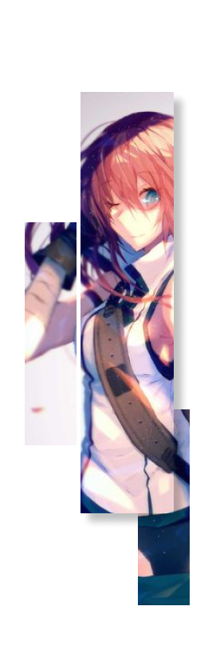

 

 

  
  

   &nbsp;
    
   &nbsp;&#10022; Just call me **Old Cat**

   &nbsp;&#10022; Currently pursuing an applied bachelor's degree in **informatics engineering**

   &nbsp;&#10022; Have good understanding of Web Development

   &nbsp;&#10022; Have understanding in Bahasa (native), English (fluent), 日本語 (a little bit)

   &nbsp;&#10022; My current goals is To become Fullstack Web Developer, and Get N5 日本語 certificate
   
   &nbsp;&#10022; Let's talk about Web development, Security, And Anime stuff
   
  

 

      

 <h4>&#10022; I'm fluent with this language &#8628;</h4>
 
 
 
 
 <h4>&#10022; I'm work with websites using &#8628;</h4>
 
 
 
  
 
 
 
 

 <h4>&#10022; I implement devops using &#8628;</h4>
  
 
 
 <h4>&#10022; I can also do designs & illustration using &#8628;</h4>
  
 
  
 
 

 
 <h4>&#10022; Other things that I use &#8628;</h4>
  
  
 
  
 
 
 

     

 

  
  

   &nbsp;
   
   &nbsp;
    
   &nbsp;&#10022; Feel free to reach me at: &#10022;

   &nbsp; 
   
   

   &nbsp;&#10022; I ussualy use Discord for chatting with friends.
   
   &nbsp;&#10022; I use Instagram for uploading my drawing content.
   
  

 

