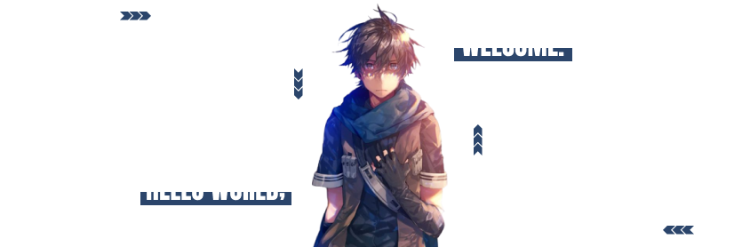

<h1 align="center">Hi there, I'm Muhammad Fauzi 👋</h1>
I'm a passionate Software Developer with a strong foundation in software development, proficient in applying core principles of software development and experienced with various technologies and frameworks to tackle complex problems.

 

 

  
  

   &nbsp;
    
   &nbsp;&#10022; **Old cat** is my code name, you may know me as Fauzi.

   &nbsp;&#10022; Currently working as a full-time **software developer** in Indonesia.

   &nbsp;&#10022; Have good understanding of Backend and Frontend Development.

   &nbsp;&#10022; Have understanding in **Bahasa** (native), **English** (fluent), **日本語** (newbie).

   &nbsp;&#10022; Loves programming, camping and watch anime.
   
   &nbsp;&#10022; Nice to meet you!
   
  

 

 
<h1 align="center">🔥 Technologies & Skills</h1>
<h4>Programming Languages</h4>

 
 
 
 
 
 
 
 
 
 

<h4>Backend Developments</h4>

 
 
 
 
 
 

<h4>Frontend Developments</h4>

 
 
 

<h4>Other Tools</h4>

 
 
 
 

<!-- 

    
    
    
    
    
    
    
    
    
    
    

 -->
